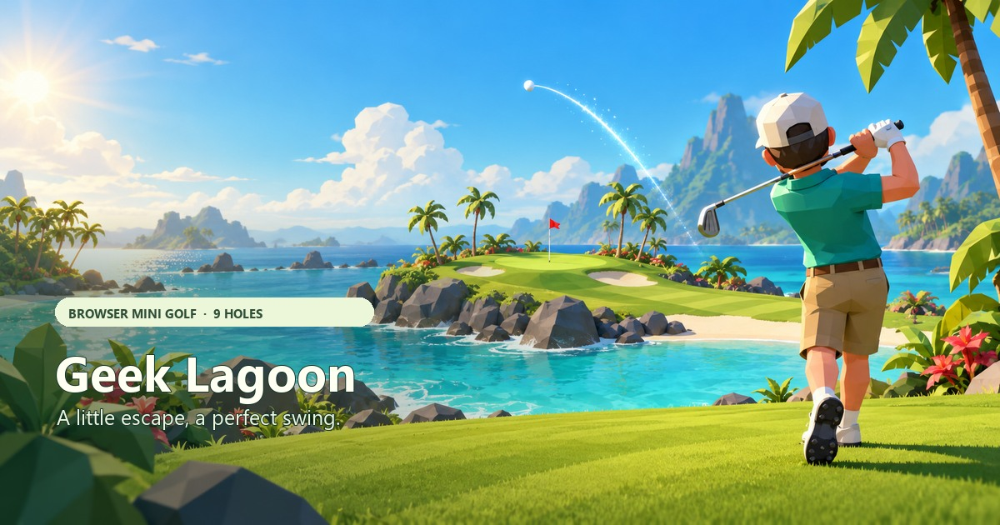

# Geek Lagoon



Geek Lagoon is a 3D mini-golf game for solo rounds or online rooms of 2–4 friends. It is built with Vite and Three.js, uses original procedural course art, and has a Thai / English interface.

Play at [minigolf.aiyarafun.com](https://minigolf.aiyarafun.com/).

## Features

- Two themed courses: Geek Lagoon (tropical) and Sunset Canyon (desert), each with nine holes and Par 36. Play a full nine-hole round or a short three-hole round.
- Create a named room, select its course, or join a room from the public list. Everyone plays simultaneously in one full-screen course with visible golfers, colored balls, and name labels. Finished players wait for everyone before the next hole.
- The room server owns physics, shared wind, strokes, the 12-stroke cap, and round progression. A disconnected player has 60 seconds to reconnect; a departure does not block the remaining players.
- Three-stage Pangya-style timing: start the power meter, lock power, then press when the cursor returns to the accuracy line.
- Four clubs with different flight and roll behavior. The distance meter is recalculated for the selected club and shows the real distance to the hole.
- Random wind speed and direction affect flight. Terrain, bunkers, water, and timing affect the result.
- Small rocks scatter across each hole with a shared deterministic layout. Ball contacts bounce and deflect; water, sand, grass and rocks have distinct particle effects.
- Female and male golfer models, player name, and four outfit presets in Profile.
- Set your name, character and outfit on the entry screen with a live 3D preview before Solo, Create Room, Join Room, or accepting an invitation link.
- A full-screen zoomable Three.js course with compact HUD widgets, animated clouds and flag, swing animation, impact effects, and sound.
- Facebook Open Graph and large-image card metadata, with the share image at `public/og-geek-lagoon.jpg`.

## Contributing / ร่วมพัฒนา

Want to help make Geek Lagoon better? Friends are welcome to share ideas, report bugs, improve the courses, or build new game features. Open an [Issue](https://github.com/prasertsakd/minigolf/issues) or send a Pull Request. เริ่มต้นได้ที่ [CONTRIBUTING.md](CONTRIBUTING.md) — ยินดีต้อนรับทุกไอเดียครับ

## Run locally

Requires Node.js and npm.

```sh
npm install
npm run dev
```

Open the local URL printed by Vite. For a production build and local production preview:

```sh
npm run build
npm run preview
```

For online room development, also run the local Cloudflare Worker in a second terminal:

```sh
npm run dev:server
```

Vite proxies `/api` and WebSockets to port 8790. Open the Vite URL in separate tabs or devices to join the same room. Solo works independently of this server. Choose your character and outfit in Profile before joining a room.

## Controls

| Action | Control |
| --- | --- |
| Aim | Drag one finger horizontally on the course; desktop arrow keys or HUD buttons |
| Start charge | Mobile shot button, Space, or desktop mouse click on the course |
| Lock power, then lock accuracy | Mobile shot button or a tap on the course; desktop Space or mouse click |
| Cancel before the swing | Esc |
| Select a club | Number keys 1–4, or the club buttons |
| Switch camera | C or the camera button |
| Zoom | Mouse wheel, `+` / `−` buttons, or a two-finger pinch |

On mobile, the shot button starts charging. During the next two stages, tap the course or use the button to lock power and timing. Horizontal course drags still aim, and pinch stays zoom-only. Audio unlocks on an actual interaction and retries after a mobile interruption.

## Project layout

```text
src/
  courses.js   Course and hole data
  physics.js   Ball flight, surfaces, wind, and prediction
  shot.js      Charge / accuracy timing and swing poses
  range.js     Club-specific range meter calculations
  world.js     Three.js course, golfer, cameras, and effects
  touch.js     Drag aiming, tap-to-lock timing, pinch exclusion and touch-click suppression
  audio.js     Gesture-unlocked procedural Web Audio
  surface-effects.js Bounded water, sand, grass and rock particles
  main.js      Game state, HUD, controls, profile, and audio
  room-game.js Authoritative multiplayer model, physics, and hole barriers
  multiplayer.js WebSocket session, reconnect, and room API client
  room-ui.js   Solo / Create / Join screens and waiting-room UI
  style.css    HUD, menus, modals, and responsive layout
tests/         Node test suite for physics, shots, courses, range, rig, and touch
public/        Static assets copied to the Vite build
worker/        Cloudflare Worker, room directory and per-room Durable Objects
CONTRIBUTING.md  How to get started and submit a contribution
```

## Checks

```sh
npm test
npm run build
```

The tests cover ball flight and putting, hazards and wind, all holes and clubs, range scale, three-stage timing, missed timing, swing alignment, and touch input.

With the local room server running, `npm run test:multiplayer` also exercises four real WebSockets, concurrent shots, retry deduplication, reconnect, waiting for other players, all three hole barriers, and final scores. It creates a temporary local room and takes about two minutes.

## License

Original Geek Lagoon code and project-created game assets are licensed under the MIT License; see [LICENSE](LICENSE). Third-party dependencies remain under their respective licenses.

## Deploy

The existing Cloudflare Pages project is `minigolf`; `wrangler.toml` points its build output to `dist/`.

```sh
npm run deploy
```

This builds the site and uses Wrangler Pages Direct Upload. Cloudflare authentication is required. The production domain is `minigolf.aiyarafun.com`. Direct Upload is the current project setup; Git-based deployment has not been configured.

Multiplayer also requires deploying its Worker with Durable Object bindings and migrations:

```sh
npm run deploy:server
npm run deploy
```

`worker/wrangler.toml` routes only `minigolf.aiyarafun.com/api/*` to the room service. The existing Pages site continues serving the game. Uploading `dist/` alone does not deploy the room server. Room deployment requires authenticated Wrangler access; do not place tokens in Git.

## Share preview

The page includes Open Graph and Twitter large-image metadata. The 1200×630 JPEG is served from `/og-geek-lagoon.jpg`. If Facebook has already cached an older preview for the URL, refresh its scrape in Facebook Sharing Debugger after deployment.

## Local data

Player name, character, outfit, sound preference, round count, and solo best completed nine-hole score are stored in browser local storage. Room credentials live in per-tab session storage for reload/reconnect. The room service stores temporary rooms and scores, not accounts; inactive rooms are removed after 20 minutes without connected players. Balls do not collide with other players' balls.

See [project-memory.md](project-memory.md), [desicion.md](desicion.md), and [AGENTS.md](AGENTS.md) for project context, current decisions, and contributor instructions.
